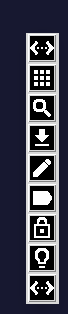

# glaunch
A little (verticle) graphic launcher (verticle) for the desktop.

>



__glaunch.py__   
>
The python/tkinter program

__mif__  
>
a directory containing many icon images for the program

__settings.sh__  
>
bash file to launch nemo and gedit for editing the glaunch.ini file  
button 1 on the launcher opens these

__glaunch.ini__   
>
The 9 line text file containing the _image_file|executable_  
eg. `ic_create_white_24dp.png|gedit`

__winfo__  
>
holds the window position geometry

---

You can change and expand the program to your own specifications.

## Use

```bash
python3 glaunch.py
python3 glaunch.py NO

```
The 'NO' argument causes the window to appear with its title bar to make positioning easier.

Once in the right position, you could execute without the argument to undecorate the window.

